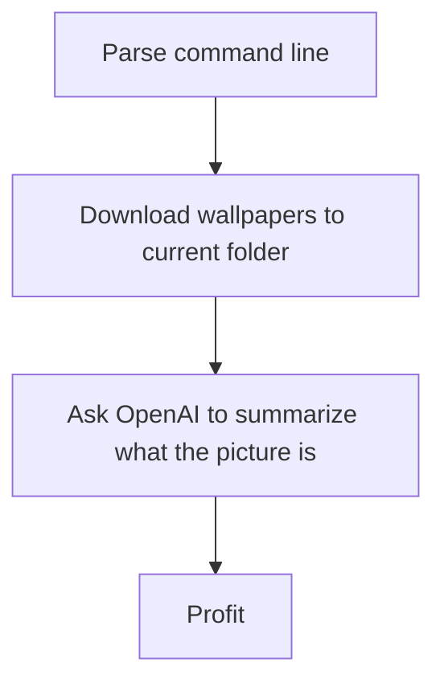
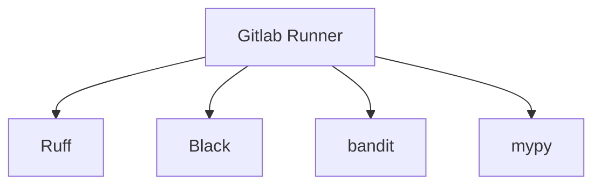

# Application flow

```mermaid
graph TD;
  A[Parse command line]-->B;
  B[Download wallpapers to current folder] -->C[Ask OpenAI to summarize what the picture is]
  C --> D[Profit]
```

# CI

```mermaid
graph TD;
  Z[Gitlab Runner] --> A[Ruff]
  Z-->B[Black];
  Z -->C[bandit];
  Z --> D[mypy];
```

