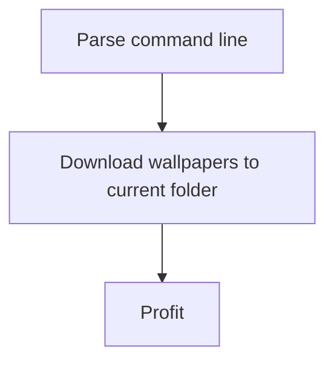
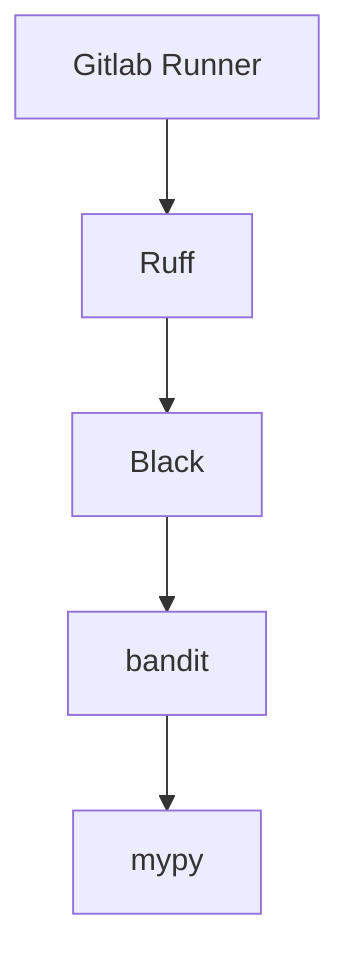

# Application flow

```mermaid
graph TD;
  A[Parse command line]-->B;
  B[Download wallpapers to current folder] -->C[Profit]
```

# CI

```mermaid
graph TD;
  Z[Gitlab Runner] --> A
  A[Ruff]-->B[Black];
  B -->C[bandit];
  C --> D[mypy];
```

